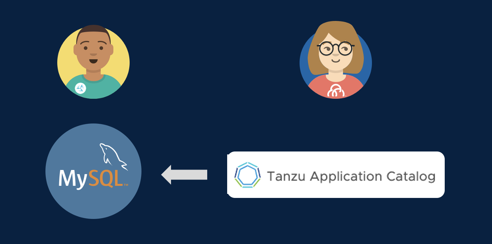

Remember earlier when we talked about how developers might want to pull in other containers that support their applications.  Even if those containers aren't affected by critical CVEs, they might not be configured to deployed in the most secure way possible.  Wouldn't it be great to address security concerns even earlier in the app lifecycle so that your developers are chosing services that have already been approved for use?  And wouldn't it be great to give those development teams a leg up on running those services the way you'd want them run in production?

Tanzu provides a catalog for services that you can offer to your developers so that they start off on the right foot much sooner and choose services that already meet your standards.  And VMware Tanzu also provides hardened images for those services that already capture the best practices for running those services in the most secure way.

Let's take a look at those capabilties.

* Go to the browser tab logged in to Tanzu Application Catalog. Click through the Application pages to get a sense of the breadth of data and application services available in the catalog. Highlight any that might be relevant for your customer.
* Type "mysql" in the "Filter your catalog" field on the left. Show that a container image and a helm chart are available as deployment options.
* Explain that each container image in TAC is built from source by VMware, secured by CVE scanners and antivirus scanners, and run through automated functional tests to ensure the container is working. Talk about how the customer has a choice of operating systems to use as the base image for a container, or they can supply their own golden base image.
* Click on the Details link to the right of the MySQL Container Image. Show how the customer has access to the security and validation reports that were run when the container was built.
* Optionally, return to the TAC homepage, and click on the "Add New Applications" button to show how customers can add their own customized artifact to the Catalog.

Cody needs a relational database backend for his spring-webdb application, so he'll be using a containerized deployment of MySQL from the Tanzu Application Catalog!

