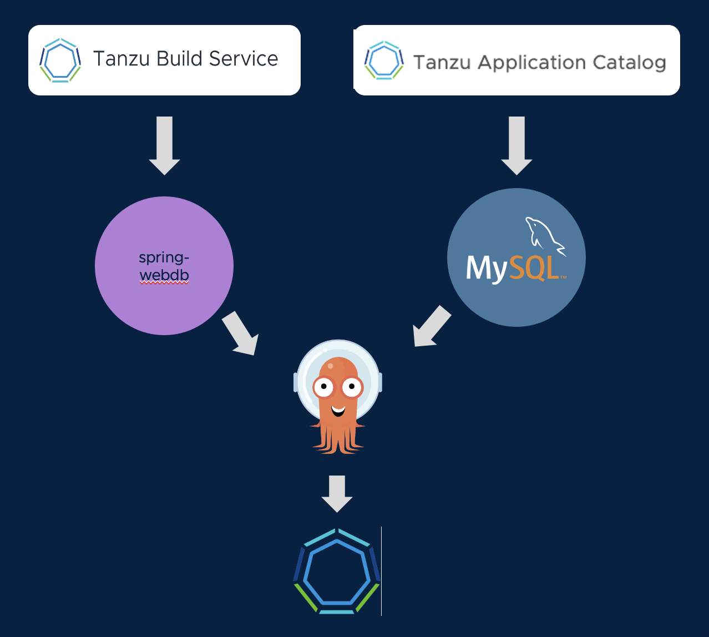

In our CI (Continuous Integration) process, we used Tanzu Build Service to synchronize our Git source repos to the container images that will run out applications.

Similarly, for our CD (Continuous Delivery) process, we want to use GitOps tooling to synchronize Git deployment repos to the running state of our cluster. Tanzu Advanced Edition works well with any GitOps tooling. For this workshop, we have decided to use ArgoCD. Let's examine the ArgoCD app that will manage deployment of our web application and database.



Let's set a watch for tracking the progress of our deployment:

```terminal:execute
command: k get pods -w -l "app in (mysql,webdb)"
session: 2
```

Go to the ArgoCD browser tab:

```dashboard:open-url
url: https://argocd.{{ ingress_domain }}/applications/{{ session_namespace }}
```

Click on the application tile with the yellow highlight to view the deployment configuration for our application. The application operator manages a Git repo that stores the deployments, configmaps, secrets, and ingresses needed to run and access our application.

The deployment for our Spring application uses the container image that was generated by Tanzu Build Service. And the deployment for our MySQL database uses the container image published by Tanzu Application Catalog. So we can be confident that all of our containers have been built securely.

Press Sync on the ArgoCD console (and then press Synchronize on the callout dialog) to begin deployment of the application. ArgoCD will begin syncing the **declared** state of the deployment in the Git Repo to the **running** state of the cluster. In the UI, you will see the Kubernetes resources from the GitOps repo begin to come online in the cluster.

It will take a few minutes for the MySQL database to deploy from scratch, and for the Spring application to successfully connect. In the watch you set, wait until the **webdb** pod shows **1/1** containers ready (it will crash and restart a couple of times while it is waiting for MySQL to come up).

```dashboard:open-url
name: Application
url: https://webdb-{{ session_namespace }}.{{ ingress_domain }}
```

Pressing the "Add Sensor" button will make writes to the attached MySQL database.

